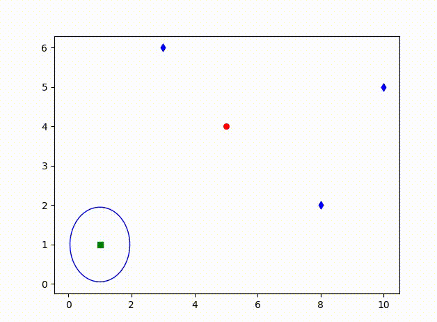

Small examples for teaching robot estimation and control:  
* force actuation in x and y on a hocky_disk
* friction with the floor
* GPS and range/angle beacons
* Estiamtion EKF (sensor fusion)
* control with PID, LQG, MPC and Factor Graph

